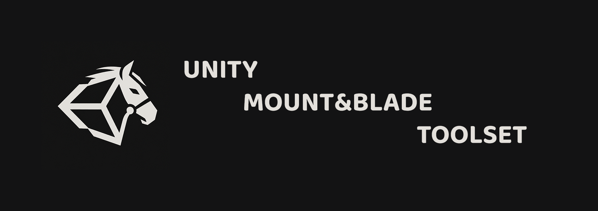

# Unity Mount&Blade Toolset (v0.2.6-beta)

MBToolset is a comprehensive editor toolkit designed to bridge the gap between Mount & Blade: Warband modding and the Unity game engine. It allows modders and developers to seamlessly import, manage, and synchronize M&B module data, scenes, and assets directly within a modern Unity environment.

## Features

### Automated Module Import Pipeline
A guided, step-by-step wizard to import any M&B module.
- Automatically resolves paths for `Native` and custom modules.
- Processes Module System Python files, converting them into structured JSON and Unity `ScriptableObject` assets.
- Imports `Textures` and automatically builds matching Unity `Materials`.

### BRF Asset Synchronization
Full integration with Mount & Blade proprietary BRF format.
- Synchronizes meshes, colliders, and material definitions.
- Automatically generates Unity Prefabs from BRF data, complete with LOD groups and collision data.

### Scene Editor & Synchronization
A powerful suite for working with M&B scenes inside Unity, centered around the **MBSceneDataManager** component. This component provides a comprehensive tab-based editing interface directly in the Unity Inspector:

- **General**: Configures core module bindings and scene metadata.
- **RGL Generator**: Brings native M&B terrain code into Unity to procedurally generate terrain base layers based on seed and ground spec hashes.
- **Heightmap**: Layered tools to splat,sculpt, smooth, and manipulate the Unity terrain heightmap.
- **Erosion**: [Hatchling erosion simulation algorithm](https://www.proceduralpixels.com/blog/terrain-hack-fastest-erosion-algorithm-ever).
- **Decorator**: Rule-based terrain texturing system that automatically applies materials based on Slope, Curvature, other filters. Inspired by [emrecancubukcu unity decorator](https://github.com/emrecancubukcu/Terrain-Decorator).
- **Flora**: Advanced vegetation populator and library system. (WIP)
- **Tint**: Vertex and terrain color painting toolset, featuring an automated Ambient Occlusion (AO) baker to enhance lighting realism.
- **AI Mesh Export**: Seamless integration with Unity's NavMesh and ProBuilder to bake, edit, and export AI navigation meshes back as `ai_mesh.obj`.
- **Export**: Validates and compiles scene data (terrain, flora, props, boundaries) back into Native M&B format.

### Particle Systems & VFX
Bridging the visual and technical gap between the engines.
- **Warband Particle System**: A custom particle simulation system built to maintain strict 1:1 parity with the M&B coordinate system and interpolation logic.
- **Custom Shaders**: Includes HLSL shader pipelines tailored for M&B specific techniques.

## Installation & Setup

For detailed installation instructions, including required Unity packages and initial configuration, please refer to the [Installation Guide](Documentation/InstallationGuide.md).

## Workflow Overview

The MBToolset dropdown menu is organized as follows:
- **Settings**: Global path configurations and Native module initialization.
- **Import Module**: The primary wizard for ingesting a new custom module data, assets, and module system Python files.
- **MB Editor**: The central hub for module editing and access to `module.ini` (module.ini now not saved to file, just for preview).
- **Sync**: Tools to manually synchronize changes from `.sco`, scene entries or updated BRF archives.

## Compatibility

- Designed for **Mount & Blade: Warband** modules.
- Built for **Unity 2021.3+**. 
- Designed as an **Editor-only** toolset.

## Credits

**Author**: markpryk

**Special Thanks**:
- **Swyter**: For [`mab-sco-tools`](https://github.com/Swyter/mab-tools/tree/master) (exporting/importing `.sco` files), the terrain code decoder, [`openbrf-redux`](https://github.com/Swyter/openbrf-redux) (used for the BRF sync tool), and immense help with reverse engineering.
- **k700**: For providing RGL sources for examination and assistance with reverse engineering.
- **mtarini**: For the initial creation of [OpenBRF](https://forums.taleworlds.com/index.php?threads/download-link-and-main-info-latest-ver-0-0-82e-19-jun-2016.72279/).
- **cmpxchg8b**: For initial source decoding and the C++ terrain generator sources (which Swyter saved and recovered).

**Technologies**: 
- Developed for **Mount & Blade: Warband** (TaleWorlds Entertainment).
- Built on **Unity Editor** APIs.
- Integrates open-source **OpenBRF** code for BRF synchronization logic.
