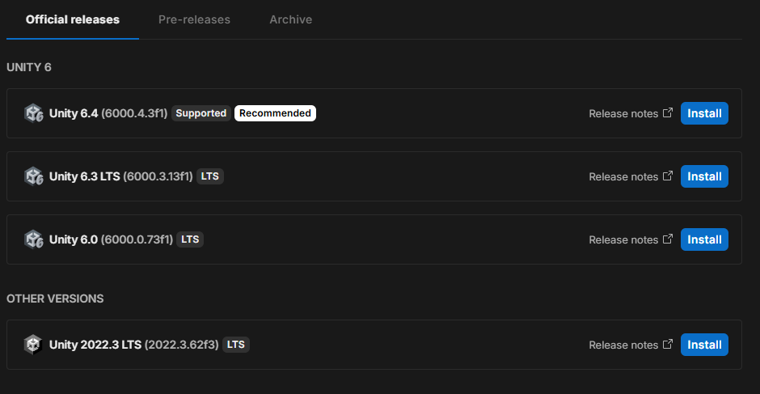
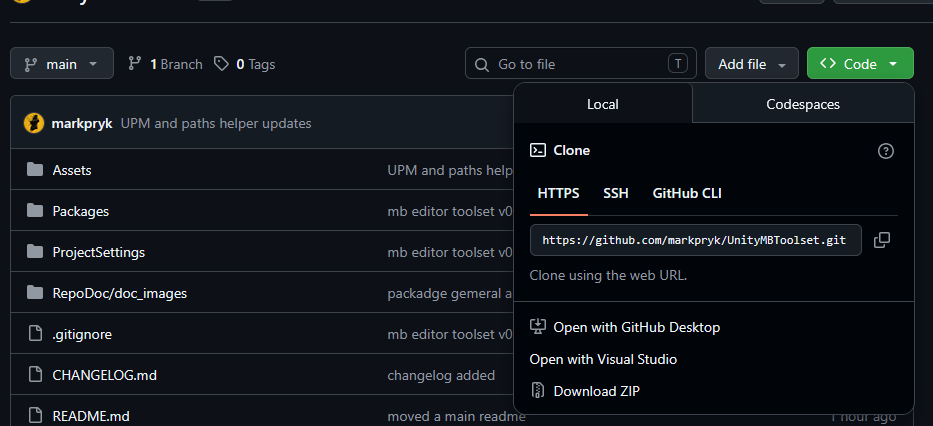
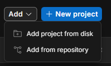
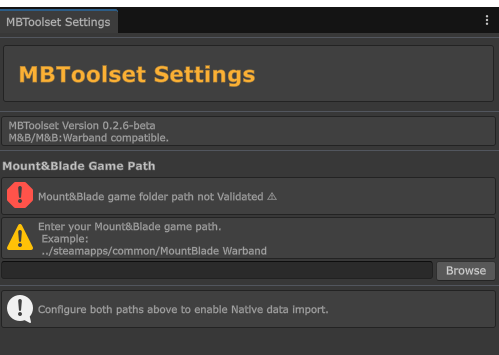

# Installation & Setup Guide

### 1. Install Unity Hub (For beginners)

If you are new to Unity, you will first need to install Unity Hub, which manages your Unity projects and editor versions.
1. Download **Unity Hub** from the [official Unity website](https://unity.com/download).
2. Run the installer and create a free Unity account if you don't have one.
3. Open Unity Hub, go to the **Installs** tab, and install **Unity 6.4**. 



### 2. Clone the Repository

Clone the project to your local machine using Git, or download it directly as a ZIP from GitHub:

```bash
git clone https://github.com/markpryk/UnityMBToolset.git
```


### 3. Add Project to Unity Hub

Open **Unity Hub**. Go to the **Projects** tab, click **Add**, and select **Add project from disk**.



Locate the `UnityMBToolset` folder you just cloned and select it.

### 4. Wait for Initialization

After the editor loads, the **MBToolset** menu will be available at the top bar, go to settings and configure paths.


